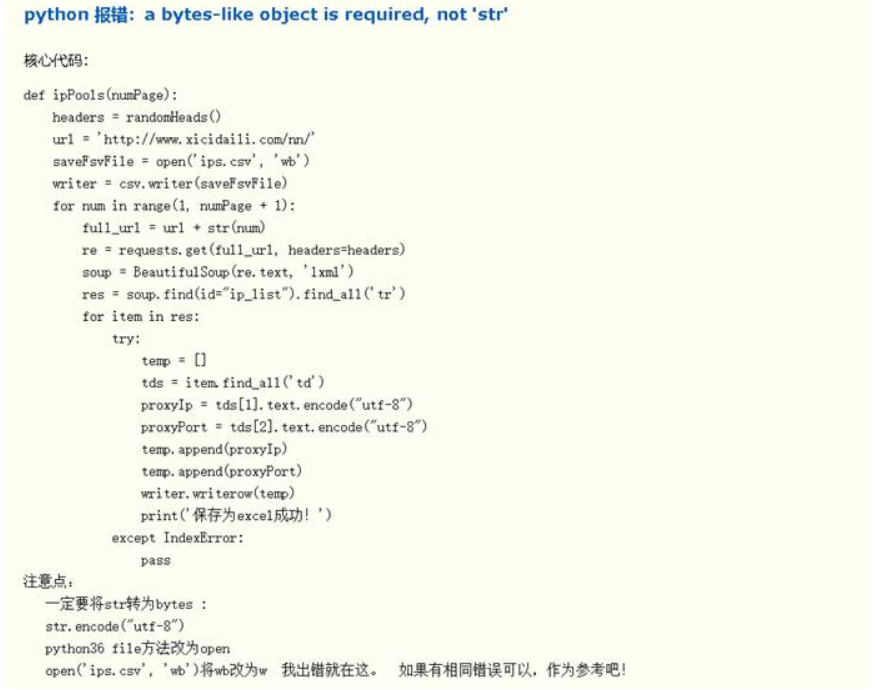
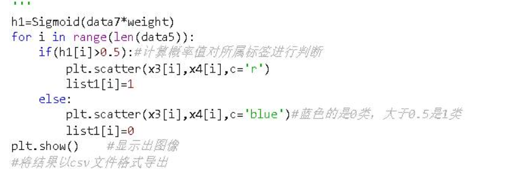
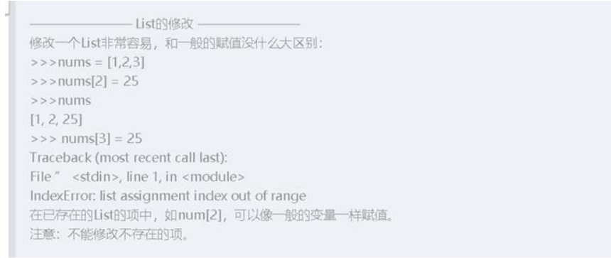
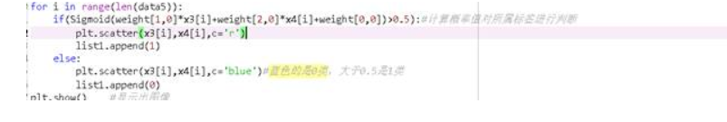
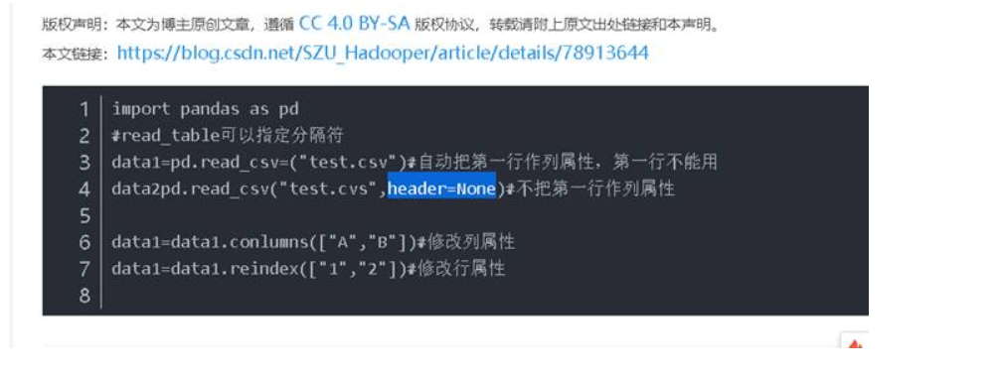

说明文档

**代码的步骤分析**

 

1. 本次作业我用了逻辑回归算法

2. 首先我定义了逻辑回归用到的Sigmoid函数（利用公式）

3. 然后定义一个专门的函数来实现最终权重的获取

4. 再将训练集的csv文件读取进来，通过给定的属性和类别标签来训练模型，即训练weight的值

5. 得到一个weight值之后再将测试集的csv文件读取进来，通过给定的属性和weight值带入到Sigmoid函数中得到对应的数据，大于0.5是1类，否则判断为0类。（事先我已经将训练集的属性和标签进行对照得出的属性和类别之间的对应关系）

6. 最后一步就是将结果以csv文件的格式导出

7. 代码分析

   # -*- coding: utf-8 -*-
   """
   Created on Wed Sep 18 15:29:04 2019

   @author: 张琳
   """

   #对给定数据集进行二分类
   import csv
   import numpy as np  
   import pandas as pd
   import matplotlib.pyplot as plt
   #定义逻辑回归的预测函数
   def Sigmoid(x):  
       return 1.0 / (1.0 + np.exp(-x))  
   #逻辑回归的实现
   def luo_ji(data,label):
       data1=np.mat(data)#将数组转换成矩阵,将特征数组转换成矩阵
       data2=np.mat(label)#将数组转换成矩阵然后再转置，方便矩阵计算，将类别（标签）数组转换成矩阵
       m,n=np.shape(data1)#m是矩阵的行，n是矩阵的列，很容易看出m=2652,n=3，得到data1矩阵的行和列
       weights=np.ones((n,1))#先初始化一个未知参数作为权重值，三行一列值均为1的矩阵
       a=0.001#规定一个学习率
       max=4000#给出一个指定的迭代步数 
       for i in range(max):#通过循环来更新权重值
           h=Sigmoid(data1*weights)#预测的概率值
           weights=weights-a*data1.transpose()*(h-data2)#更新weights的值
       return weights#得到最终的权重
   pdData=pd.read_csv('HTRU_2_train.csv',header=None)#pdData是DataFrame类型，读取csv文件
   data1=pdData.iloc[:,0:2]#属性，提取前两列属性
   type1=pdData.iloc[:,2:]#提取最后一列的标签
   #将data转换成数组（将Pandas中的DataFrame类型转换成Numpy中array类型）
   data2=np.array(data1)
   type2=np.array(type1)
   '''np.insert()函数的四个参数，第一个参数代表要操作的数组，二个参数是插入的位置，第三个参数是要插入的数值，第四个参数axis是指示在哪一个轴上对应的插入位置进行插入'''
   data3=np.insert(data2,0,1,axis=1)#data3得到的是在data2的第一列插入一系列值为1的值
   weight=luo_ji(data3,type2)#weight获取到的是最终weights的值
   #显示训练集的图像
   pdData1=pd.read_csv('HTRU_2_test.csv',header=None)
   data4=pdData1.iloc[:,:]#属性，提取前两列属性
   #转换成数组
   data5=np.array(data4)
   x= np.arange(-1, 200, 0.1)   #随机生成x，就是第一个x的值
   h = (x*(-weight[1,0])-weight[0,0])/weight[2,0]   #计算y的值，就是第二个特征的值
   plt.plot(x, h)  
   x3=data5[:,0]#取出data5的第一列，也就是第一个属性
   x4=data5[:,1]#取出data5的第二列，也就是第二个属性
   list1=[] 
   data6=np.insert(data5,0,1,axis=1)
   data7=np.mat(data6)#转换成矩阵
   for i in range(len(data5)):
       if(Sigmoid(weight[1,0]*x3[i]+weight[2,0]*x4[i]+weight[0,0])>0.5):#计算概率值对所属标签进行判断
           plt.scatter(x3[i],x4[i],c='r')
           list1.append(1)
       else:
           plt.scatter(x3[i],x4[i],c='blue')#蓝色的是0类，大于0.5是1类
           list1.append(0)
   plt.show()    #显示出图像
   #将结果以csv文件格式导出
   with open('submission2-test.csv','w') as myFile:    
       myWriter=csv.writer(myFile)
       myWriter.writerow(['id','y'])
       for i in range(len(data5)):
           myWriter.writerow([i+1,list1[i]])

 

**遇到的问题**

 

1.在最后一步以csv文件的格式导出时出现了问题，得知需要将with open('submission2-test.csv','wb') as myFile中的’wb’改成 ‘w’

2.在实现代码的过程中，我设置了个列表list1用来接收测试集样本的类别标签，我忽略了对列表元素的添加方法，直接采用’=’进行赋值，结果报错，查找发现需要采用append方法。（1）错误代码如下：

（2）上网查阅

（3）正确代码

 

3.我发现采用我所用的方式读取csv文件时，没有将csv文件的第一行读取进来，上网查找之后发现使用pd.read_csv()读取文件的时候需要加上header=None，尝试过后，将错误进行了改正。下面是我在网上查询此问题得到的解决方法

 

 